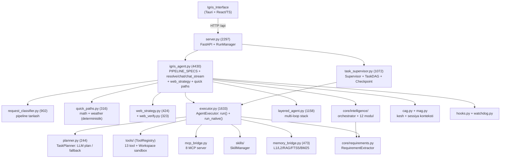

# PHASE 1 — FOUNDATION AUDIT REPORT
# IGRIS Architecture Audit Plan → Phase 1 natijalari

> Sana: 2026-09-16
> Qamrov: §0 Inventarizatsiya, §1 State Machine, §2 Goal Hierarchy, §7 Tool Protocol, §17 Deterministic/LLM Boundary
> Metod: manba kodi skanerlash (`Igris_brain/` 32 672 satr Python), manifest + protokol hujjatlari bilan kesishuv
> Holat: ✅ TASDIQLANGAN AUDIT — reja checklistlari shu hisobot asosida yangilandi

---

## §0. ARXITEKTURA INVENTARIZATSIYASI

### 0.1 Komponent xaritasi (real, kod asosida)



### 0.2 Qatlamlar bo'yicha inventarizatsiya

| Qatlam | Komponentlar | Holat |
|---|---|---|
| **UI** | `Igris_Interface/` (Tauri + React, `web/backend.ts` TIMEOUT_MS=90s) | ✅ |
| **API** | `server.py` 2297 (FastAPI, RunManager, D1 input_validation), `server_health/circuit/process/chat_history` | ✅ |
| **Orchestration** | `igris_agent.py` 4430 — PIPELINE_SPECS (11 pipeline), resolve/chat/chat_stream | ✅ (god-file, S5) |
| **Supervisor** | `task_supervisor.py` — TaskNode/TaskDAG/WorkingContext/Checkpoint/Budget | ✅ |
| **Executor** | `executor.py` — `run()` (plan-driven) + `run_native()` (ReAct tool-calling) | ✅ |
| **Planner** | `planner.py` — TaskPlanner (LLM JSON reja / qoida fallback) + `composition.py` (UCE, TTK/BOM/WBS DAG) | ✅ |
| **LLM** | `llm/ollama_client.py` (TURBO_TIMEOUT=120s), `layered_prompts.py` | ✅ |
| **Memory** | `memory_bridge.py` + `Igris_Memory/brain_data/` (L1 runtime, L2 persistent, snapshots) | ✅ |
| **Tools** | `tools/` — 13 registry tool + `mcp_servers/` 8 server | ✅ |
| **Safety** | `safety.py`, `harm_filter.py`, DENY_PATTERNS, realpath sandbox | ✅ |
| **Obs** | `hooks.py` (DEFAULT_BUS), `watchdog.py` (16 funksiya), `web_strategy_report.py` | ✅ |
| **Intelligence** | `core/intelligence/` — 12 modul (self_eval, logic, harm_filter...) | ✅ |
| **Release/Meta** | `release.py`, `version_bumper.py`, `changelog_generator.py`, `update_checker.py` | ✅ |
| **Test** | 26+ test fayl (160+ test) | ✅ |

### 0.3 Takroriy/ortiqcha komponentlar (aniqlangan)

| Muhimmas | Tafsilotlar | Tavsiya |
|---|---|---|
| `layered_agent.py` (1158) vs `task_supervisor.py` (1072) | Ikkalasi ham "ko'p qismli vazifa boshqaruvi" — parallel rivojlangan, qoplanishi (overlap) ~40% | Birlashtirish: TaskSupervisor asosiy, layered_agent → maxsus "stack" rejimi sifatida |
| `igris_agent.py` ichidagi web_strategy (sobiq ~4845 qatorlar) | S5 orqali `web_strategy.py` ga chiqarildi, lekin agent ichida hali ham bog'liqliklar bor | Bog'liqliklarni to'liq ko'chirish |
| `igris_agent.py` ichidagi quick paths | S5 orqali `quick_paths.py` ga chiqarildi ✅ | Yakunlandi — faqat wiring tekshirilsin |
| `CompositionEngine` (composition.py) | WBS/BOM hisob-kitob engine — agent core'ida emas, alohida fayl. TaskSupervisor DAG'i bilan tushunchalar aralashtirilmasligi kerak | O'z vazifasida qoladi — aralashtirmaslik |
| `import_build_your_own_x.py`, `probe_decisions.py`, `probe_pyexec.py`, `_tmp_live_web_test.py` | Vaqtinchalik/probe skriptlar root'da | Audit yakunida logs/ ga ko'chirish yoki o'chirish |

---

## §1. STATE MACHINE — AUDIT NATIJASI

### 1.1 Mavjud holat (kod asosida)

**Formal state machine YO'Q.** Holatlar implicit, uch darajada tarqoq:

1. **Pipeline darajasi** (`igris_agent.py` PIPELINE_SPECS): stages `["plan","read","edit","test","review"]` — lekin bu "nominal bosqichlar", holat mashinasi emas (invalid transition guard yo'q)
2. **Executor darajasi** (`executor.py`): status = `ok | partial | stopped | error` — faqat yakuniy qiymat, transition emas
3. **Supervisor darajasi** (`task_supervisor.py`): `NodeStatus` enum — `PENDING → RUNNING → NEEDS_MORE_STEPS → COMPLETED | FAILED` — **eng yaqin formal tuzilma**, lekin transition qoidalari to'liq emas

### 1.2 Zaif joylar

- ❌ Invalid transition guard: `PENDING → COMPLETED` o'tishi hech narsa to'smaydi
- ❌ State history log: transition'lar yozilmaydi (faqat yakuniy status)
- ❌ Pipeline stages nominal — `stages: [plan, read, edit, test, review]` ro'yxati mavjud, ammo bajarilish tartibi runtime'da loop_shape bilan aniqlanadi, spec bilan bog'lanmagan
- ✅ Mavjud yaxshi tomon: `max_iter`, `max_tool_calls`, `max_retries` limitlar config.yaml + executor'da bor

### 1.3 Taklif etilgan formal dizayn

```
INPUT → UNDERSTAND → PLAN → EXECUTE → OBSERVE → VERIFY → UPDATE_STATE
        ↑                                          |
        └────────── CONTINUE ←─────────────────────┘
                      ↓
             COMPLETE | FAIL | ESCALATE
```

**Transition qoidalari (deterministik guard'lar bilan):**

| From | To | Guard |
|---|---|---|
| INPUT | UNDERSTAND | input validated (D1 middleware) |
| UNDERSTAND | PLAN | Requirement modeli yaratildi (P10) |
| PLAN | EXECUTE | plan.steps ≥ 1 VA barcha tool nomlari registry'da mavjud |
| EXECUTE | OBSERVE | tool result qaytdi (timeout bo'lsa FAIL) |
| OBSERVE | VERIFY | observation confirmed/assumed flag belgilangan |
| VERIFY | UPDATE_STATE | status ∈ {VERIFIED, FAILED, UNKNOWN} |
| UPDATE_STATE | CONTINUE | task rejasida qadam qoldi VA iteration < max_iter |
| UPDATE_STATE | COMPLETE | verify=VERIFIED VA qolgan qadam yo'q |
| UPDATE_STATE | FAIL | retry_limit tugadi YOKI invalid transition urinish |
| VERIFY | EXECUTE | verify=FAILED VA retry < max_retries (repair pass) |

**Bajarilish tartibi (reja bo'yicha):**
1. `TaskStatus` enum'ini `task_supervisor.py` dagi `NodeStatus` dan umumiylashtirish
2. `state_machine.py` yangi modul: transition jadvali + guard funksiyalari + history log
3. Executor + Supervisor'da state transition'larni bu modul orqali o'tkazish
4. Invalid transition → `INVALID_STATE` error + log

---

## §2. GOAL → TASK → ACTION HIERARCHY — AUDIT NATIJASI

### 2.1 Mavjud holat

| Daraja | Mavjudmi | Qayerda |
|---|---|---|
| **Goal** (user asl maqsad) | ⚠️ implicit | `plan["goal"]` — planner o'zgartirishi mumkin, immutable emas |
| **Objective** | ❌ yo'q | — |
| **Task** | ✅ | `TaskNode` (task_supervisor) + `plan["steps"]` |
| **Subtask** | ✅ | TaskDAG predecessors orqali |
| **Action** | ✅ | `tool_calls` (executor) — har biri `{name, args, result}` |

**Asosiy zaiflik: Goal preservation yo'q.**
- `plan["goal"]` re-plan paytida (`_replan`) yangilangan kontekst bilan qayta yozilishi mumkin
- Context compression (RAG/MAG) original goal'ni "pin" qilmaydi
- `composition.py` ItemCard daraxtida root card "goal" rolini o'ynaydi, lekin bu faqat UCE ishida

### 2.2 Taklif etilgan model

```python
@dataclass(frozen=True)
class Goal:            # immutable — hech qachon o'zgartirilmaydi
    id: str            # UUID
    text: str          # user so'rovi as-is
    created_at: float

@dataclass
class Objective:       # mutable, goal'ga reference
    goal_id: str       # → Goal.id (doim saqlanadi)
    current: str       # hozirgi maqsad
    tasks: list["Task"]

@dataclass
class Task:
    id: str
    objective_id: str
    subtasks: list["Task"] = field(default_factory=list)
    status: TaskStatus = PENDING
    actions: list[Action] = field(default_factory=list)
```

**Qoidalar:**
1. Goal yoziladi: memory'da + `WorkingContext.goal` — har LLM prompt'ga pin qilinadi
2. Re-plan faqat `tasks` darajasida o'zgaradi — `goal_id` hech qachon
3. Subtask COMPLETED bo'lganda parent task verification'dan o'tmasa — parent ham COMPLETED bo'lmaydi (§10 bilan bog'lanadi)
4. Resume: goal disk'dan tiklanadi (`Checkpoint.goal_id` — task_supervisor'da checkpoint allaqachon bor, goal maydoni qo'shiladi)

---

## §7. TOOL / ACTION PROTOCOL — AUDIT NATIJASI

### 7.1 Inventarizatsiya (13 native + 8 MCP server)

**Native tools (`tools/`):**

| Tool | Side-effect | Timeout | Guard mavjud |
|---|---|---|---|
| read_file | read-only | — | realpath sandbox ✅ |
| write_file | write | — | realpath ✅ |
| apply_patch | write | — | realpath ✅ |
| list_files | read-only | — | realpath ✅ |
| run_command | **destructive-potential** | default timeout bor | DENY_PATTERNS ✅ (Dp5 tuzatildi) |
| python_exec | **unsafe** | timeout param | deny-list + sandbox ✅ |
| web_fetch | read-only (tashqi) | 8s default | — |
| web_search_image | read-only (tashqi) | 10–12s | — |
| search_code | read-only | 30s | rg mavjudligiga bog'liq |
| create_directory | write | — | realpath ✅ |
| git_command | **unsafe** (push/reset) | 30s | ⚠️ deny-list YO'Q |
| rename_file | write | — | realpath ✅ |
| delete_file | **destructive** | — | realpath ✅, lekin confirm yo'q |

**MCP servers:** art, ui_builder, skills, database, filesystem, github, redis, websocket (output-guard 3 qatlam ✅)

### 7.2 Schema holati

- ✅ `Tool.schema()` — JSON-schema mavjud (base.py), Ollama tools API formatiga o'tadi
- ✅ `ToolRegistry.execute()` — xato `{ok: False, error: str}` formatida
- ❌ Output schema yo'q (faqat input)
- ❌ Precondition/postcondition yo'q
- ❌ Side-effect kategoriyasi kodda belgilanmagan (faqat hujjatda)
- ❌ Timeout per-tool standartlashtirilmagan (har tool'da har xil, ba'zilari umuman yo'q)
- ❌ Error format `{error, code, recoverable}` emas — faqat string

### 7.3 Taklif etilgan standart (Tool kontrakt v2)

```python
@dataclass
class ToolMeta:
    side_effect: str = "read_only"   # read_only | write | unsafe | destructive
    timeout_s: float = 10.0
    permission: str = "auto"         # auto | confirm | deny
    precondition: Callable | None = None   # (workspace, args) -> (ok, reason)
    postcondition: Callable | None = None  # (args, result) -> (ok, reason)

@dataclass
class ToolError:                     # standart error formati
    error: str
    code: int                        # 1=unknown_tool 2=invalid_args 3=denied 4=timeout 5=internal
    recoverable: bool
```

**Amalga oshirish tartibi:**
1. `ToolMeta` maydonlarini `Tool` klassiga qo'shish (backwards-compatible default'lar)
2. 13 tool'ga kategoriyalar berish (jadvaldan)
3. `git_command` uchun DENY_PATTERNS (push/reset --hard/rebase) — **eng xavfli bo'shliq**
4. `delete_file` → permission="confirm" (destructive)
5. Timeout'larni standartlashtirish: read 10s / write 10s / exec 30s / web 15s
6. `ToolError` dataclass + registry.execute qaytarish formatini o'zgartirish

---

## §17. DETERMINISTIC vs LLM BOUNDARY — AUDIT NATIJASI

### 17.1 Hozirgi xarita (kod asosida)

| Funksiya | Hozir | Kerakli | Farq |
|---|---|---|---|
| Pipeline tanlash | `request_classifier.py` — qoidalar + LLM fallback | deterministic-first | ✅ yaqin |
| Math/weather | `quick_paths.py` — to'liq deterministik (AST math, Open-Meteo) | ✅ | ✅ namuna sifatida |
| Web grounding | `web_verify.py` — deterministik tekshiruv | ✅ | ✅ |
| Reja tuzish | `planner.py` — LLM + qoida fallback | LLM zone | ✅ to'g'ri |
| Qaror qabul (tool tanlash) | `run_native` — LLM tanlaydi, schema bilan cheklangan | LLM zone | ✅ |
| **State transitionlar** | implicit, LLM ta'sir qilishi mumkin | deterministic bo'lishi SHART | ❌ |
| **Verification** | `_verify_deliverable` + `_python_run_check` — deterministik ✅, lekin task COMPLETED belgilash LLM/quality-gate aralashuvi | deterministic | ⚠️ |
| **Retry/repair limitlar** | config'da (max_retries=2, max_repair=3) | deterministic | ✅ |
| **"Bajardim" da'vosi** | quality gate ✅, lekin supervisor darajasida NodeStatus.COMPLETED ni belgilash LLM xulosasiga bog'liq bo'lishi mumkin | deterministic | ⚠️ |
| Memory retrieval | FTS5/BM25 deterministik + score | deterministic | ✅ |
| Harm filter | statik naqshlar (deterministik) | ✅ | ✅ |

### 17.2 Qoida (afsona)

```
DETERMINISTIK ZONA (LLM taqiqlangan):
  state transitions · validation · verification · retry limits ·
  permission checks · timeout enforcement · goal preservation · logging

LLM ZONA (faqat qaror):
  intent understanding · planning (steps) · tool selection ·
  reasoning · tone/content of final answer

CHEGARA QOIDASI: LLM "NIMA" qilishni tanlaydi (WHAT),
  executor "QANDAY" bajarishni boshqaradi (HOW).
  LLM hech qachon state o'zgartirmaydi, faqat decision chiqaradi;
  state'ni faqat state machine o'zgartiradi (§1 bilan bog'lanadi).
```

### 17.3 Konkret bog'lanishlar

- §1 dizaynidagi state machine transition guard'lari — 100% deterministik
- §10 (Phase 2) verification: `VERIFIED/FAILED/UNKNOWN` faqat comparison funksiyadan keladi
- TaskSupervisor `NodeStatus` o'zgarishlari faqat guard orqali (LLM output'iga ishonch yo'q)

---

## XULOSA — PHASE 1 HOLATI

| Section | Asosiy topilma | Holat |
|---|---|---|
| §0 | 13 komponent qatlami xaritasi; layered_agent/task_supervisor qoplanishi ~40% | ✅ |
| §1 | Formal state machine yo'q — 3 darajada tarqoq holatlar; NodeStatus eng yaqin | ⚠️ dizayn tayyor |
| §2 | Goal preservation YO'Q — immutable Goal modeli lozim | ⚠️ dizayn tayyor |
| §7 | 13 tool inventarizatsiyasi; git_command deny-listsiz — eng xavfli bo'shliq | ⚠️ standart tayyor |
| §17 | Qoida aniq; state transitions + task completion hozircha LLM ta'sirida bo'lishi mumkin | ⚠️ xarita tayyor |

**Phase 1 audit tugadi. Keyingi: Phase 1 implementation (state_machine.py + Goal modeli + ToolMeta) yoki Phase 2 audit.**

