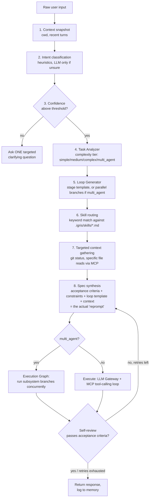

# igris-cli

A local, Claude-Code-style agent with its own project folder (`.igris/`,
playing the role `.claude/` plays for Claude Code), its own MCP servers,
its own skill library convention, a multi-provider LLM Gateway (Ollama,
LM Studio, or OpenRouter), and — the part that actually matters — a
bounded **context-understanding + reprompt loop** that sits between your
raw input and the model, so a vague or underspecified message doesn't
turn into a vague or underspecified answer. A Tauri+React desktop UI
(`desktop/`) sits on top of the same backend for anyone who wants a
visible, live view of the loop instead of a terminal.

Windows-first by design: default shell is PowerShell, WSL is never chosen
automatically, and setup below assumes native Windows with a Windows-native
Python. Everything also runs fine on Linux/macOS (that's what this was
built and tested against).

## Status: what's actually verified

Being direct about this rather than letting "125 tests pass" imply more
than it does (see `requirements-alignment-audit`):

- **Backend + CLI: yes, real and verified.** 125 passing tests, real
  spawned MCP subprocess servers (not mocked protocol), a real live
  FastAPI server exercised with curl/WebSocket clients, and real usage
  against a live Ollama setup that surfaced and led to fixing an actual
  bug (`qwen2.5-coder`'s JSON-as-text tool calls). `igris` is usable as a
  CLI agent today.
- **Desktop web app: verified by real execution, not just static
  checks.** 66 component/integration tests, clean `tsc`/`vitest`/`vite
  build`, *and* `npm run verify:bundle` loads the actual production
  `dist/` bundle into a real JS engine and executes it -- React genuinely
  mounts real DOM content with zero script errors, in both the
  backend-unreachable fallback path and the normal path with a live
  backend. This is the shipped artifact actually running, not a
  synthetic component-test render.
- **The native Tauri shell: not yet verified, and confirmed not
  possible in this environment.** Two independent, confirmed blockers:
  Tauri v2 needs Rust 1.85+ (`edition2024`) but this sandbox's rustc is
  capped at 1.75 (`rustup`/`static.rust-lang.org` are network-denied
  outright, `403 host_not_allowed`) -- and separately, even Rust version
  aside, there's no real browser/webview obtainable here either
  (`chromium`/`chromium-browser` both fail to install, requiring `snapd`
  which fails on unrelated package 404s in this container). So the one
  remaining gap is specifically the native window/IPC layer, isolated
  and well-understood -- not the web app itself, which is now the most
  strongly verified part of the desktop side. Verify with `cargo tauri
  dev` on Windows via `rustup` (see `desktop/README.md` for the full
  account of what was tried and why).

## Documentation map

This file covers the whole project. Each module has its own README with
what it does, its boundary (what must NOT live there), and how it's
tested -- read the relevant one before editing:

- [`igris/README.md`](igris/README.md) -- backend package overview
  - [`igris/core/README.md`](igris/core/README.md) -- the reprompt loop and everything it orchestrates
  - [`igris/core/providers/README.md`](igris/core/providers/README.md) -- LLM Gateway provider implementations
  - [`igris/mcp_servers/README.md`](igris/mcp_servers/README.md) -- the tools the agent can actually call
- [`desktop/README.md`](desktop/README.md) -- the Tauri shell specifically
  - [`desktop/src/README.md`](desktop/src/README.md) -- the React frontend
  - [`desktop/src/components/README.md`](desktop/src/components/README.md) -- presentation layer
  - [`desktop/src/lib/README.md`](desktop/src/lib/README.md) -- the API client
- [`AGENTS.md`](AGENTS.md) -- terse, operational conventions for any
  coding agent (igris itself, Claude Code, Cursor, Aider, ...) working in
  this repo -- build/test commands, non-negotiable rules, where to look
  first. Read this instead of this README if you're an agent, not a human.

## Why the reprompt loop, not just a system prompt

Piping raw chat straight into a small local model tends to produce shallow
or inconsistent output, because the model never gets a stable frame to
answer inside. `igris` doesn't send your message to the model as-is. Every
turn goes through this pipeline first:



Concretely: stage 8 is the reprompt. The model never sees "fix the bug in
main.py" alone — it sees that plus category-specific acceptance criteria,
Windows-first/English-docs constraints, the Loop Generator's stage
methodology, the actual git status and file contents stage 7 pulled in,
and (on a retry) the previous attempt's reviewer feedback. Stage 9's
self-review is an LLM-as-judge pass that checks the draft against those
same acceptance criteria before anything reaches you, bounded by
`loop.max_review_iterations` so it can never loop forever. When Task
Analyzer detects multiple independent subsystems in one request (e.g.
"build the frontend, backend, and database schema"), Loop Generator
produces separate per-subsystem stage templates instead of one, and
Execution Graph runs them concurrently via `asyncio.gather` rather than
one after another.

All of this lives in `igris/core/reprompt_loop.py`, `intent_resolver.py`,
`task_analyzer.py`, `loop_generator.py`, `execution_graph.py`, and
`spec.py` — read those directly if you want the exact logic.

## Layout

```
igris-cli/
  igris/
    cli.py                    entry point (igris new/use/projects, igris, igris -p "...")
    server.py                  FastAPI+WebSocket bridge for the desktop UI
    workspace.py               resolves which project a task runs against
    config.py                 loads .igris/config.yaml with sane defaults, persists edits
    memory.py                 session log + checkpoint store
    core/
      reprompt_loop.py        the mini-loop described above
      intent_resolver.py      heuristic classifier + clarify-gate
      task_analyzer.py        complexity tier: simple/medium/complex/multi_agent
      loop_generator.py       Coding/Research/Debug/Writing stage templates + parallel branches
      execution_graph.py      DAG executor -- runs multi_agent branches concurrently
      context_engine.py       cheap snapshot + targeted MCP-backed gather
      skill_loader.py         parses .igris/skills/*.md, routes by keyword
      spec.py                 TaskSpec: the structured "reprompt"
      mcp_manager.py          spawns MCP servers over stdio, aggregates tools
      gateway.py               LLM Gateway: picks a provider from config
      llm_common.py            shared ChatResult + JSON-tool-call fallback parser
      cost.py                   honest token-cost estimation (0.0 unless configured)
      embeddings.py             local-first embedding client (Ollama /api/embed)
      knowledge_base.py         hierarchical project knowledge store (project + per-module DBs)
      knowledge_router.py       keyword-based routing to the right module scope
      knowledge_seed.py         igris's own seed knowledge content + seed_all() runner
      ollama_client.py        Ollama /api/chat provider
      providers/
        openai_compatible.py   shared client for any OpenAI-protocol server
        lmstudio_provider.py   LM Studio (local)
        openrouter_provider.py OpenRouter (hosted, needs an API key)
    mcp_servers/               <- Layer 1 "Core MCP" from the architecture plan
      filesystem_server.py    read/write/list/search/move/delete, path-escape guarded
      terminal_server.py      PowerShell-first run_command, WSL only if asked
      git_server.py           status/diff/log/commit/branch
      knowledge_server.py      knowledge_search / knowledge_add / knowledge_list_modules
    skills/                   default skill library, copied into .igris/skills/ on init
      intent-resolver.md
      clarification-guard.md
      specification-expander.md
      quality-reviewer.md
      windows-first-guard.md
    templates/                 default .igris/config.yaml and .igris/mcp.json
  desktop/                     Tauri + React desktop UI -- see desktop/README.md
  projects/                    <- created on first `igris new` -- one subfolder per project
    my-app/
      .igris/                  config.yaml, mcp.json, skills/, memory/ (per-project)
      ...files the agent creates/edits...
  .active_project               plain text: name of the currently selected project
  tests/
    test_reprompt_loop.py     unit tests, MockLLM stands in for a provider
    test_ollama_fallback.py   regression test for the qwen2.5-coder JSON-tool-call bug
    test_providers.py         OpenAI-compatible client + gateway factory tests
    test_task_analyzer.py     complexity tier heuristics
    test_loop_generator.py    stage template generation
    test_execution_graph.py   DAG layering, parallelism, cycle detection
    test_multi_agent_loop.py  end-to-end: multi-subsystem request -> parallel branches -> merge
    test_config.py            settings persistence to .igris/config.yaml
    test_server.py            FastAPI REST + WebSocket endpoints (real TestClient, no mocked HTTP)
    test_workspace.py         project resolution logic (new/use/projects)
    smoke_mcp.py              live diagnostic: spawns real MCP servers, calls every tool
    mock_llm.py
```

## One install, many projects

Everything lives inside `igris-cli/` itself -- there's no separate project
folder to keep track of on your Desktop. `projects/` is created the first
time you run `igris new`, and every task (file edits, terminal commands,
git operations) is sandboxed to `projects/<active-project>/`, no matter
what directory you launched `igris` from. This is enforced at the MCP
layer: `mcp_manager.py` pins each spawned tool server's working directory
to the resolved project path via `StdioServerParameters(cwd=...)`, not
just by convention.

```powershell
igris new my-app        # creates projects\my-app\, scaffolds .igris\, makes it active
igris projects          # lists projects, marks the active one with *
igris use my-app        # switch active project
igris -p "..."          # runs against the active project
igris --project my-app -p "..."   # one-off run against a specific project (also sets it active)
```

If you only ever have one project, you never need `use` or `--project` --
`igris` auto-selects the single existing project. It only asks you to
disambiguate once a second project exists and neither is active.


## Setup (Windows, PowerShell)

```powershell
# 1. Have Ollama running locally with a tool-calling model pulled
ollama pull qwen3

# 2. Install igris-cli (editable install so `igris` and the MCP server
#    subprocesses resolve correctly)
cd path\to\igris-cli
pip install -e .

# 3. Create your first project -- this lives INSIDE igris-cli\projects\,
#    not somewhere else on disk
igris new my-app

# 4. Run it -- from anywhere, it operates on projects\my-app\
igris                # interactive REPL
igris -p "explain what this project does"   # one-shot
igris --debug        # prints every mini-loop stage as it runs

# Managing multiple projects:
igris new another-app
igris projects        # * marks the active one
igris use my-app       # switch back
```

On Linux/macOS the same commands work; `terminal_server.py` falls back to
`bash -lc` automatically when the host isn't Windows.

## LLM Gateway: switching providers

`gateway.provider` in `.igris/config.yaml` picks which backend `igris`
talks to -- `ollama` (default), `lmstudio`, or `openrouter`. All three
share the same tool-calling loop and JSON-text fallback (see
`llm_common.py`), so nothing else in the pipeline needs to know which one
is active.

```powershell
igris --provider lmstudio -p "..."      # one-off override, also persists it
igris --provider openrouter --model anthropic/claude-3.5-sonnet -p "..."
```

Or edit directly:

```yaml
gateway:
  provider: "lmstudio"
lmstudio:
  host: "http://localhost:1234/v1"   # LM Studio's local server
  model: "local-model"                # whatever LM Studio has loaded
```

OpenRouter needs an API key -- either `openrouter.api_key` in the config
or the `OPENROUTER_API_KEY` environment variable. The desktop app's
Settings panel (see `desktop/README.md`) edits all of this without
touching YAML by hand, and never echoes a saved key back out.

## Desktop UI

`desktop/` is a Tauri + React app that talks to the same backend over a
local FastAPI bridge (`igris/server.py`, REST + one streaming WebSocket).
It shows the reprompt loop running live -- each stage lights up in the
right-hand Loop panel as `RepromptLoop` emits it -- plus a project
switcher, skill/MCP tool inspector, the provider Settings panel, and a
status bar tracking session token usage and estimated cost (see below).
See `desktop/README.md` for setup; it's a separate install (Node + Rust)
on top of the Python backend, not required for the CLI.

## Reducing unnecessary clarifying questions

Intent confidence now has two thresholds, not one:

- Below `hard_block_confidence_threshold` (default 0.35): genuinely too
  ambiguous -- igris still asks.
- Between that and `clarify_confidence_threshold` (default 0.55): igris
  proceeds anyway, but prepends a plain stated assumption to the response
  ("_Treating this as a 'command' request..._") instead of spending a
  round-trip on something reasonably inferable. Say so if the guess was
  wrong and it corrects in one message.
- At or above 0.55: proceeds normally, no note.

This is deliberate -- see the `autonomous-verification-loop` principle:
most ambiguity is cheap to state-and-proceed through; only genuinely
divergent or costly-to-reverse interpretations are worth a full stop.

## Token usage and cost tracking

Every run reports real token counts, captured from each provider's
actual API response (Ollama's `prompt_eval_count`/`eval_count`, or
OpenAI-protocol `usage.prompt_tokens`/`completion_tokens` for LM
Studio/OpenRouter) and summed across the whole tool-calling loop --
including retries and, for multi_agent requests, every parallel branch.

Cost is estimated honestly, never fabricated: local providers (Ollama,
LM Studio) always report `$0.00` since they're genuinely free.
OpenRouter cost is computed only from rates you explicitly set in
`.igris/config.yaml` (`openrouter.price_per_1k_prompt_tokens` /
`..._completion_tokens`) -- left unset, cost shows as `$0.00` meaning
"not configured," not "free." See `igris/core/cost.py`.

The desktop app's status bar accumulates both across the whole session
(not just the last run), and resets when you switch projects.

## Project knowledge base (RAG, hierarchical -- not one flat DB)

`igris/core/knowledge_base.py` + the `knowledge` MCP server give the
agent a searchable store of rules, descriptions, and code templates
about the project it's working in -- consulted automatically during
context gathering for code_task/bug_fix/review requests (see
`context_engine.py`), and directly queryable/extendable via the
`knowledge_search`/`knowledge_add` tools.

Deliberately **not** one big DB, for speed and precision:

```
.igris/knowledge/
  project.json              <- Level 1: whole-project rules & overview
  modules/
    backend.json              <- Level 2: main modules
    frontend.json
    backend.core.json         <- Level 3: sub-modules, dot-addressed
    backend.mcp_servers.json
    backend.providers.json
    backend.server.json
    frontend.components.json
    frontend.lib.json
```

A query is routed (`knowledge_router.py`, keyword-based, no LLM call) to
the smallest relevant scope, then searched there plus every ancestor
scope up to the project level -- a `backend.core` query also sees
`backend`-level and project-wide rules, but never unrelated branches
like `frontend.*`. Each file stays small (a few dozen entries), so plain
cosine similarity in pure Python is enough; no vector DB server or numpy
needed at this scale.

Embeddings are local-first via Ollama's `/api/embed` endpoint,
`nomic-embed-text` by default: ~274MB, ~137M parameters, loads in about
a second, runs even CPU-only -- comfortably under an 8GB VRAM budget.
Swap the model via `embeddings.model` in `.igris/config.yaml`.

```powershell
ollama pull nomic-embed-text
igris seed-knowledge          # embeds and stores igris's own seed data
                               # (igris/core/knowledge_seed.py) for the active project
```

The seed data is real and project-specific (33 entries covering every
module down to concrete code templates), not generic filler -- tagged by
provenance (`manual` = a fact about this project's actual design,
`web_verified` = checked against a current external source,
`llm` = general recalled convention).

## Coder Knowledge Memory (durable, reusable artefacts)

`Memory` remains the short-term session log and checkpoint store. It is not
used as a dumping ground for all conversations. `CoderMemoryStore` adds a
separate, project-local artefact library under `.igris/coder_memory/`:

```
.igris/coder_memory/
  manifest.json        <- standard metadata for every artefact
  indexes.json         <- category/tag/language/framework/source/project indexes
  artifacts/<id>/      <- original Markdown, source, config, diagram, or payload
```

It accepts the engineering memory categories (project, architecture, folder
structure, code/API/design/UI patterns, configuration, error/debug/testing,
security/performance, database/DevOps/deployment, decisions and lessons), plus
the common metadata contract: source, version, licence, quality/trust/reuse
scores, related artefacts and optional embedding id. Retrieval is hybrid by
design: existing `knowledge` vector search handles embedded project facts, and
Coder Memory's deterministic metadata/content index remains available when
Ollama embeddings are offline.

```powershell
igris collect-memory                 # deterministic README/config/ADR/tree collection
igris --project my-app collect-memory
```

The agent retrieves relevant Coder Memory during task context gathering. It
must only persist a verified, source-backed reusable artefact or a verified
Error -> Cause -> Fix lesson; raw chat transcripts, secrets and unverified
guesses are explicitly excluded by the system prompt and memory-governance
skill.

## Verification MCPs

New projects (and existing projects on their next scaffold/migration) receive
three additional local MCP servers:

- `memory`: collect/search/ingest source-backed artefacts and verified lessons.
- `sandbox`: copies project source to `.igris/sandbox/runs/<id>/workspace` and
  runs only named profiles (`python_pytest`, `desktop_vitest`, etc.). It
  isolates ordinary test writes; it is not a VM for untrusted code.
- `browser`: Playwright user journeys for local/project URLs: fill inputs,
  click buttons, assert text/visibility/URL, and save screenshots. External
  destinations require an explicit opt-in.

Install the browser once for the browser MCP:

```powershell
cd desktop
npm install
npx playwright install chromium
```

## Skill file convention

Skills in `.igris/skills/*.md` follow the same convention as the paired
Claude Code skill library this project mirrors:

```markdown
---
name: my-skill
description: one line, what this skill is for
pipeline_stage: Planning   # Architecture | Planning | Implementation | Review | ...
triggers: [keyword, keyword]
defers_to: [other-skill]
used_by: [reprompt-loop]
---

## Scope
...
## Procedure
...
## Anti-patterns
...
```

Routing (`skill_loader.py`) is pure keyword matching against `triggers` —
no LLM call — so which skills fire for a given turn is deterministic and
you can predict it just by reading the frontmatter. Drop new `.md` files
into `.igris/skills/` and they're picked up automatically; no registration
step.

## MCP servers included

The bundled, real MCP stdio servers now cover core filesystem/terminal/git
work, hierarchical vector knowledge, durable Coder Memory, source-copy test
sandboxes, and local Playwright browser journeys. Each server is registered in
`.igris/mcp.json`; `mcp_manager.py` discovers it without special-casing a
provider. Browser automation remains intentionally local by default, and the
sandbox is explicit about being workspace isolation rather than a security VM.

## Testing

```powershell
pip install -e .[dev]   # or: pip install pytest
python -m pytest tests\ -v                          # full backend suite (125 tests)
python tests\smoke_mcp.py                            # real MCP servers, no LLM needed
```

`test_reprompt_loop.py` uses `MockLLM` to verify the pipeline's control
flow directly: ambiguous input triggers clarification and never reaches
execution; a clear task runs once and returns on a passing review; a
failing review retries once with feedback folded into the next attempt's
system prompt; retries are hard-capped by `loop.max_review_iterations`.

`test_multi_agent_loop.py` drives a request naming multiple subsystems
("frontend, backend, and database") end-to-end through Task Analyzer ->
Loop Generator -> ExecutionGraph and checks the branches actually ran
concurrently and merged correctly.

`test_providers.py` replays a captured OpenAI-protocol tool-call response
(including the `tool_call_id` echo-back OpenAI requires) against a fake
transport, and checks the gateway factory picks the right client per
`gateway.provider`.

`test_server.py` exercises the FastAPI app directly via `TestClient` --
real routes, real `MCPManager`/real MCP server subprocesses, only the LLM
provider is swapped for `MockLLM` -- including the streaming WebSocket
end-to-end. The whole REST+WebSocket surface was also run once against a
live `uvicorn igris.server:app` process during development, not just the
test client.

`smoke_mcp.py` spawns the real filesystem/terminal/git MCP servers and
exercises every tool, including the safety gates (delete requires
`confirm=true`, path traversal outside the project root is refused).

## Known limitations / next steps

- Only Core-tier MCP servers are implemented; browser and desktop
  automation (Layers 2–3 in the original plan) aren't built yet.
- `intent_resolver.py`'s heuristics are keyword/regex-based and tuned for
  a mix of English and Uzbek phrasing — extend `CATEGORY_KEYWORDS` as you
  hit misclassifications.
- The self-review stage is a single LLM-as-judge call per attempt; it's
  cheap but not infallible — treat `loop.max_review_iterations` as a
  latency/quality knob, not a correctness guarantee.
- `task_analyzer.py`'s multi_agent detection is keyword-based (needs 2+
  named subsystems from a fixed list) -- it won't catch a multi-subsystem
  request phrased without those words.
- The desktop app's Rust shell hasn't been compiled in this environment
  (needs Rust 1.77+/edition2024 via rustup; this sandbox only had an
  older apt-installed toolchain) -- see `desktop/README.md` for exactly
  what was and wasn't verified.
- No bundled Python runtime for the desktop app yet -- it spawns the
  already-`pip install -e .`'d backend as a child process rather than a
  self-contained PyInstaller sidecar.
